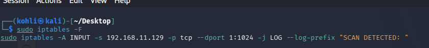
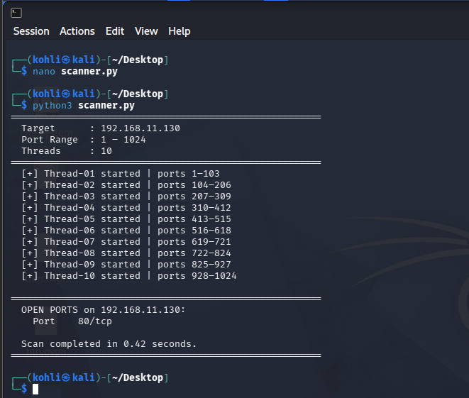
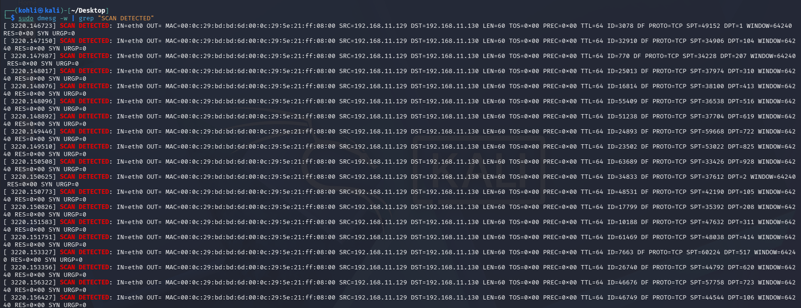
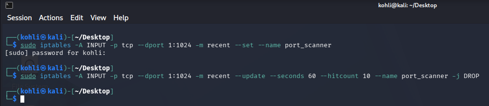
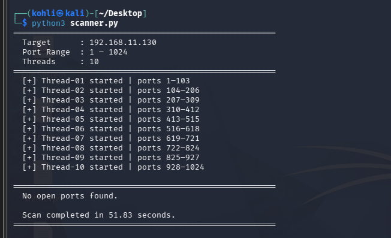
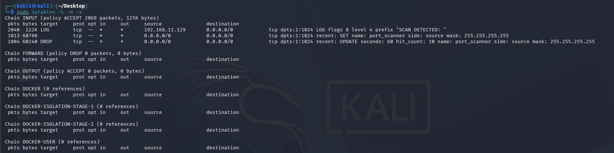

# Multi-Threaded Port Scanner with Defensive Firewall Detection

A two-sided network security lab: a Python multi-threaded TCP port scanner built from scratch, tested against a hardened target running `iptables`-based detection and prevention rules. Explores the project from both the **offensive** (scanning, evasion) and **defensive** (logging, rate-limiting, DROP rules) perspectives, plus a deep dive into thread synchronization and race conditions.

> ⚠️ **Educational use only.** This scanner is intended for authorized lab environments and personal/isolated VMs you own or have explicit permission to test. Scanning networks or systems without authorization is illegal in most jurisdictions.

## Lab Environment

| Component | Attacker VM | Target VM |
|---|---|---|
| OS | Kali Linux | Kali Linux |
| IP Address | 192.168.11.129 | 192.168.11.130 |
| Role | Scanner / Attacker | Scanned / Defender |

## How It Works

The scanner takes a target IP and a port range (1–1024), splits the range evenly across **10 worker threads** using ceiling division, and has each thread call `socket.connect_ex()` (0.5s timeout) on every port in its chunk. A non-blocking exit code of `0` means the port is open.

Because port scanning is I/O-bound — most time is spent waiting on the network, not computing — multi-threading gives a near-linear speedup:

| Scan Method | Worst-Case Time (1–1024 ports) | Speed Gain | Detection Risk |
|---|---|---|---|
| Sequential (1 thread) | ~512s | 1× (baseline) | Low (slow) |
| 10 Threads (this project) | ~51.5s | ~10× | High (rapid) |
| 50 Threads | ~10.3s | ~50× | Very High |

## Thread Safety: Mutex & Race Conditions

All 10 threads append discovered open ports to a single shared list. Without a lock, two threads can race to read the list's length and overwrite each other's entry — silently losing a discovered open port (a **false negative**). A `threading.Lock()` around each `results.append()` call serializes these writes, eliminating the race with negligible performance cost (open ports are rare, so lock contention is minimal).

```python
with lock:
    results.append(port)
```

See [`Assignment_3_Report.pdf`](./Assignment_3_Report.pdf) §4 for a full step-by-step trace of the race condition and how the mutex prevents it.

## Demo: Phase 1 — Detection

An `iptables` rule logs every inbound SYN packet from the attacker IP on ports 1–1024:



Running the scanner finds the open HTTP port, and the kernel log fingerprints the scan via its high-frequency, sequential, SYN-only pattern:





## Demo: Phase 2 — Prevention

A two-rule `recent` module chain automatically drops packets once the attacker exceeds 10 SYN attempts in 60 seconds:



Re-running the scanner against the hardened target returns nothing — every packet is silently dropped before reaching any service:



The packet counters confirm the DROP rule is actively matching and discarding traffic:



## Evasion Techniques (Discussed in Report)

- **Low-and-slow scanning** — random delays between probes to stay under the rate-limit threshold
- **Decoy scanning** (`nmap -D`) — spoofed source IPs to obscure attribution
- **Source IP rotation** — VPN/Tor/botnet to avoid per-IP rate limits
- **Fragmented packets** — splitting SYN packets to slip past stateless filters
- **Non-SYN probes** (FIN/NULL/XMAS) — bypassing SYN-only LOG rules

## Limitations of iptables as a Standalone Defense

- No Layer 7 (application-layer) visibility
- Vulnerable to low-and-slow scans below the rate threshold
- No correlation across multiple time windows (memoryless)
- Trivially bypassed by IP rotation/spoofing
- Vulnerable to log flooding / disk exhaustion attacks

Full discussion in [`Assignment_3_Report.pdf`](./Assignment_3_Report.pdf) §3.3.

## How to Run

Requires Python 3 — no external dependencies, only the standard library.

1. Edit the configuration constants at the top of `scanner.py` to set your target:
   ```python
   TARGET_IP    = "192.168.11.130"
   START_PORT   = 1
   END_PORT     = 1024
   NUM_THREADS  = 10
   TIMEOUT      = 0.5
   ```
2. Run it:
   ```bash
   python3 scanner.py
   ```

## Project Structure

```
.
├── scanner.py               # Multi-threaded port scanner (mutex-protected)
├── Assignment_3_Report.pdf  # Full report: architecture, evasion, defense, race-condition analysis
├── images/                  # Screenshots from the lab demo
└── README.md
```

## Authors
 Muhammad Moeen
